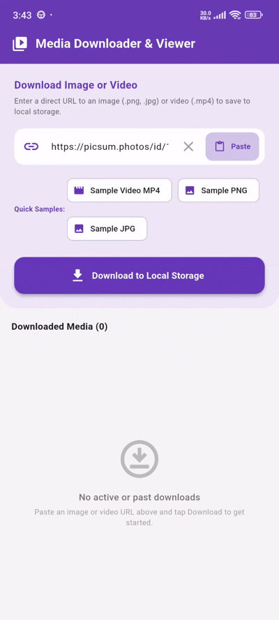

# flutter_download_manager_notification_service

[](https://flutter.dev)
[](https://opensource.org/licenses/MIT)
[](#)

**flutter_download_manager_notification_service** is a premium, robust, and feature-rich background media download management library for Flutter. It provides real-time progress tracking, native notification bar updates, automatic media URL resolution (including Pinterest photo pins), smart file type validation, customizable download list tiles, and a built-in interactive in-app media viewer.

---

## 📷 Preview

<p align="center">
  
</p>

*A high-performance media downloader featuring live progress notifications, instant URL pasting, status badges, download controls (pause, resume, retry, cancel), and direct in-app or system gallery media viewing.*

---

## ✨ Features

- **🚀 Real-Time Background Downloads**
  - High-performance background task execution powered by native Flutter Downloader isolates.
  - Live progress stream (`updates`) emitting instant download state and percentage changes.
- **🔔 Native Progress Notifications**
  - Integrated notification status bar progress indicators matching live download states.
  - Automatic fallback progress notifications for custom HTTP stream down-streams.
- **📌 Pinterest & Web Media Auto-Resolver**
  - Built-in `MediaUrlResolver` that resolves web links and Pinterest pin URLs into direct high-resolution image/video download sources.
- **🔍 Smart Validation & Type Detection**
  - Automatically identifies image (`.png`, `.jpg`, `.jpeg`, `.gif`, `.webp`, `.heic`) and video formats (`.mp4`, `.mkv`, `.mov`, `.avi`, `.3gp`).
  - Filters web pages, GitHub repositories, and unsupported archive formats (`.zip`, `.rar`, `.7z`) with descriptive error messages.
- **📱 Built-In Interactive Media Viewer**
  - Fullscreen `InAppMediaViewer` widget featuring pinch-to-zoom for images and custom video player controls for video files.
- **🎨 Ready-to-Use UI Tile Widget**
  - `DownloadItemTile` provides a polished Material 3 design complete with media type icons, status chips, animated progress bars, and full playback/control buttons.
- **🛡️ Resilient HTTP Fallback Engine**
  - Automatically recovers and completes downloads via a fallback client if native background enqueue fails.

---

## 📦 Installation

To use this library in your Flutter project, add it to your `pubspec.yaml` dependencies:

```yaml
dependencies:
  flutter:
    sdk: flutter
  # From pub.dev
  flutter_download_manager_notification_service: ^0.0.1
```

Or reference it directly from a Git repository:

```yaml
dependencies:
  flutter_download_manager_notification_service:
    git:
      url: https://github.com/Harshc216/flutter_download_manager_notification.git
      ref: stage
```

---

## 🚀 Usage

Import the package in your Dart code:

```dart
import 'package:flutter_download_manager_notification_service/flutter_download_manager_notification_service.dart';
```

### 1. Initialize the Download Service
Initialize the service once during app startup or state initialization before starting any downloads:

```dart
final DownloadService _downloadService = DownloadService();

@override
void initState() {
  super.initState();
  _initDownloader();
}

Future<void> _initDownloader() async {
  await _downloadService.initialize();

  // Listen to live progress and status updates
  _downloadService.updates.listen((update) {
    print('Task ${update.taskId}: ${update.status.name} (${update.progress}%)');
  });
}
```

### 2. Downloading an Image or Video URL
Pass any valid media URL (including Pinterest pin links) to start downloading:

```dart
try {
  final DownloadItem item = await _downloadService.download(
    url: 'https://commondatastorage.googleapis.com/gtv-videos-bucket/sample/ForBiggerBlazes.mp4',
    openWithSystemApp: true,
  );
  print('Started downloading ${item.fileName} with Task ID: ${item.taskId}');
} catch (e) {
  print('Download error: $e');
}
```

### 3. Display Download Progress Tile
Use `DownloadItemTile` to present a rich UI tile with progress, status badge, and control buttons:

```dart
DownloadItemTile(
  item: item,
  onPause: () => _downloadService.pause(item.taskId),
  onResume: () => _downloadService.resume(item.taskId),
  onCancel: () => _downloadService.cancel(item.taskId),
  onRetry: () => _downloadService.retry(item.taskId),
  onOpen: () => _downloadService.openFile(item: item, context: context),
  onToggleOpenMode: (openWithSystem) {
    setState(() {
      item.openWithSystemApp = openWithSystem;
    });
  },
)
```

### 4. Opening Downloaded Media
Open the downloaded file using either the native system gallery app or the package's built-in fullscreen `InAppMediaViewer`:

```dart
// Automatic opening based on item.openWithSystemApp setting
await _downloadService.openFile(
  item: item,
  context: context,
);

// Or explicitly open the interactive In-App Viewer directly
Navigator.push(
  context,
  MaterialPageRoute(
    builder: (_) => InAppMediaViewer(
      filePath: item.filePath!,
      fileName: item.fileName,
      mediaType: item.mediaType,
    ),
  ),
);
```

---

## 🛠️ API Reference

### `DownloadService`

| Method / Property | Type | Description |
| :--- | :--- | :--- |
| `initialize()` | `Future<void>` | Initializes background downloader isolates and notification channels. |
| `download(...)` | `Future<DownloadItem>` | Resolves media URL, validates format, enqueues background task, and returns `DownloadItem`. |
| `pause(String taskId)` | `Future<void>` | Pauses an active download task. |
| `resume(String taskId)` | `Future<void>` | Resumes a paused download task. |
| `cancel(String taskId)` | `Future<void>` | Cancels an ongoing download task. |
| `retry(String taskId)` | `Future<void>` | Retries a failed or cancelled download task. |
| `openFile(...)` | `Future<void>` | Opens a completed download item using system default app or in-app viewer. |
| `updates` | `Stream<DownloadTaskUpdate>` | Stream emitting real-time download progress and status changes. |
| `dispose()` | `void` | Closes stream controllers and releases isolate resources. |

---

### `DownloadItem`

| Property | Type | Default | Description |
| :--- | :--- | :--- | :--- |
| `taskId` | `String` | *(required)* | Unique background task identifier. |
| `url` | `String` | *(required)* | Original URL passed for downloading. |
| `fileName` | `String` | *(required)* | Sanitized name of the target file. |
| `mediaType` | `MediaType` | `image` / `video` | Inferred media type (`MediaType.image` or `MediaType.video`). |
| `status` | `DownloadStatus` | `queued` | Current status (`queued`, `downloading`, `paused`, `completed`, `failed`, `cancelled`). |
| `progress` | `int` | `0` | Download progress percentage (0 - 100). |
| `savedDir` | `String?` | `null` | Local filesystem directory path where file is saved. |
| `openWithSystemApp` | `bool` | `true` | `true` to open with system app/gallery; `false` for in-app media viewer. |
| `filePath` | `String?` | `null` | Full absolute path to the local downloaded file. |
| `isCompleted` | `bool` | - | Returns `true` if download status is `completed`. |
| `isDownloading` | `bool` | - | Returns `true` if download status is `downloading`. |
| `isImage` | `bool` | - | Returns `true` if item is an image file. |
| `isVideo` | `bool` | - | Returns `true` if item is a video file. |

---

### `DownloadItemTile`

| Property | Type | Description |
| :--- | :--- | :--- |
| `item` | `DownloadItem` | The target download item data model. |
| `onPause` | `VoidCallback` | Callback triggered when user taps Pause button. |
| `onResume` | `VoidCallback` | Callback triggered when user taps Resume button. |
| `onCancel` | `VoidCallback` | Callback triggered when user taps Cancel icon. |
| `onRetry` | `VoidCallback` | Callback triggered when user taps Retry button. |
| `onOpen` | `VoidCallback` | Callback triggered when user taps Open Media button. |
| `onToggleOpenMode` | `ValueChanged<bool>` | Callback triggered when open mode toggle preference changes. |

---

### `InAppMediaViewer`

| Property | Type | Description |
| :--- | :--- | :--- |
| `filePath` | `String` | Absolute local path of the image or video file. |
| `fileName` | `String` | File name header displayed in app bar. |
| `mediaType` | `MediaType` | Specified `MediaType.image` or `MediaType.video`. |

---

## 📄 License

```lic
MIT License

Copyright (c) 2026 Excelsior Technologies

Permission is hereby granted, free of charge, to any person obtaining a copy
of this software and associated documentation files (the "Software"), to deal
in the Software without restriction, including without limitation the rights
to use, copy, modify, merge, publish, distribute, sublicense, and/or sell
copies of the Software, and to permit persons to whom the Software is
furnished to do so, subject to the following conditions:

The above copyright notice and this permission notice shall be included in all
copies or substantial portions of the Software.

THE SOFTWARE IS PROVIDED "AS IS", WITHOUT WARRANTY OF ANY KIND, EXPRESS OR
IMPLIED, INCLUDING BUT NOT LIMITED TO THE WARRANTIES OF MERCHANTABILITY,
FITNESS FOR A PARTICULAR PURPOSE AND NONINFRINGEMENT. IN NO EVENT SHALL THE
AUTHORS OR COPYRIGHT HOLDERS BE LIABLE FOR ANY CLAIM, DAMAGES OR OTHER
LIABILITY, WHETHER IN AN ACTION OF CONTRACT, TORT OR OTHERWISE, ARISING FROM,
OUT OF OR IN CONNECTION WITH THE SOFTWARE OR THE USE OR OTHER DEALINGS IN THE
SOFTWARE.
```
